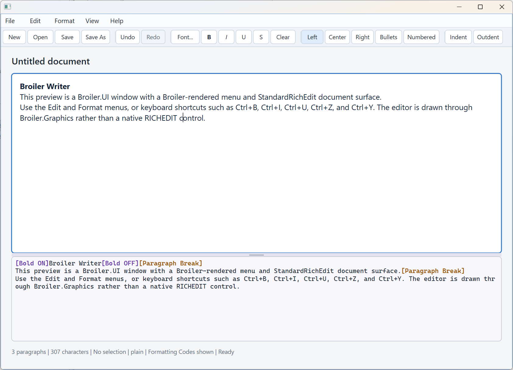
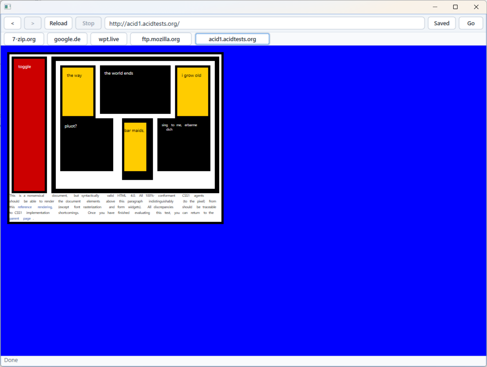

# Broiler Platform

> **Browser and Office Infrastructure in Intermediate Language with Enhanced Reliability**

[](LICENSE)

**Latest Releases:** https://github.com/Broiler-Platform/Broiler/releases

---

## Hi there 👋

Welcome to the **Broiler Platform**.

Broiler is an open-source platform project exploring a deliberately difficult question:

> **Can modern browser and office applications be built entirely in managed .NET?**

No Chromium.

No embedded WebView.

No native browser engine.

Just managed .NET, modular architecture, standards compliance, automated testing, AI-assisted engineering, and human review.

Broiler is **not** a wrapper around an existing browser.

It is a platform for building browsers, office applications, and future document-centric software on a shared managed runtime.

---

# Platform Snapshot

| Component | Status |
|-----------|--------|
| ECMAScript (Test262) | **>99.99% passing** |
| Web Platform Tests | **61% passing** |
| Platforms | Windows, Linux |
| Applications | Broiler Browser, Broiler Writer |
| Document Formats | RTF, HTML, Markdown, DOCX |

---

# Architecture

```
                    Broiler Platform

     ┌───────────────────────────────────────────────┐
     │                                               │
     │ ECMAScript • DOM • CSS • Layout • Graphics    │
     │ UI • Input • Document • Runtime               │
     │                                               │
     └───────────────────┬───────────────────────────┘
                         │
          ┌──────────────┴──────────────┐
          │                             │
   Broiler Browser              Broiler Writer
```

The browser and writer are the first reference applications built on top of the shared Broiler Platform.

---

# Current Preview

These screenshots show the current Windows Direct2D frontend rendering real-world content during development.

<table>
  <tr>
    <td width="50%">
      
    </td>
    <td width="50%">
      
    </td>
  </tr>
  <tr>
    <td align="center"><sub>google.de</sub></td>
    <td align="center"><sub>7-zip.org</sub></td>
  </tr>
  <tr>
    <td width="50%">
      
    </td>
    <td width="50%">
      
    </td>
  </tr>
  <tr>
    <td align="center"><sub>wpt.live</sub></td>
    <td align="center"><sub>ftp.mozilla.org</sub></td>
  </tr>
  <tr>
    <td width="50%">
      
    </td>
    <td width="50%">
      
    </td>
  </tr>
  <tr>
    <td align="center"><sub>Broiler Writer</sub></td>
    <td align="center"><sub>Acid1 - Test</sub></td>
  </tr>
</table>

---

# Current Status

Broiler is under active development and **not yet intended for production use**.

### Implemented

- ECMAScript / JavaScript engine
- HTML runtime
- CSS engine (ongoing standards compliance)
- Document model
- Rich text editing
- Platform-independent UI framework
- Platform-independent input abstraction
- Browser frontend
- Writer frontend
- RTF import/export
- HTML import/export
- Markdown import/export
- DOCX import/export
- Automated Test262 integration
- Automated Web Platform Tests (WPT)

### In Progress

- HTML/CSS compatibility
- Layout engine improvements
- Cross-platform graphics backends
- Browser shell
- Office infrastructure
- WebAssembly frontend

For WebAssembly Broiler plans to integrate an existing managed .NET runtime such as **WACS**, avoiding unnecessary duplication.

---

# Engineering Principles

## 100% Managed .NET

Every major subsystem is intended to be implemented in managed .NET.

The goal is improved maintainability, portability, auditability, and long-term evolution.

## Standards First

Compatibility is measured—not guessed.

Broiler continuously validates itself using:

- Test262
- Web Platform Tests (WPT)

## Modular Architecture

Large systems become understandable by separating them into small, focused components.

The same modularity also makes AI-assisted development significantly more effective.

## AI-Assisted, Human-Reviewed

AI accelerates implementation.

Humans remain responsible for architecture, review, verification, and quality.

Every accepted change is reviewed before becoming part of the project.

## Browser and Office Together

Browsers and office suites share far more infrastructure than they appear to.

Rather than implementing these foundations twice, Broiler builds them once.

---

# Why Broiler Exists

Modern browsers and office suites are among the largest software systems in existence.

They share many of the same foundations:

- Document models
- Styling
- Layout
- Graphics
- Fonts
- Input
- Text editing
- Runtime services
- Scripting

Broiler explores whether these foundations can become one reusable managed platform.

---

# Enhanced Reliability

The **"Enhanced Reliability"** part of the name reflects the engineering philosophy behind Broiler.

```
Managed .NET
+ Modular Architecture
+ AI-Assisted Engineering
+ Human Review
+ Automated Standards Testing
--------------------------------
= Enhanced Reliability
```

AI can generate code quickly.

Reliable browser and office infrastructure requires considerably more.

Broiler therefore combines AI-assisted development with human review, modular design, and continuous standards verification.

---

# Why .NET?

Managed runtimes eliminate entire classes of memory-management issues.

Combined with modern tooling, strong refactoring support, and cross-platform capabilities, .NET provides an excellent foundation for a large modular platform.

---

# Why Another Browser?

Because browsers are too important to stop experimenting with.

Broiler investigates whether browser technology can become simpler to understand, easier to maintain, and easier to evolve without sacrificing standards compliance.

---

# Why Another Office?

Broiler Writer is **not** intended to clone existing office suites.

Instead, it serves as the reference application for the shared document platform that browsers and office applications can both build upon.

---

# Project Story

Broiler started with a simple question:

> **Can a modern browser be built entirely in managed .NET?**

The usual answer was always:

> "Use Chromium."

Broiler's answer remained:

> "No. Entirely in .NET."

Early experiments reused ideas from projects such as **HTML Renderer** and **YantraJS**.

These experiments quickly demonstrated that a production-quality browser could not simply be assembled from existing components.

The architecture was gradually rebuilt into smaller modules.

Test262 and Web Platform Tests became integral parts of the development workflow.

As the browser evolved, a second realization emerged:

A browser and an office suite require almost the same underlying infrastructure.

That insight transformed Broiler from a browser experiment into a broader application platform.

---

# Roadmap

Current priorities include:

- Higher WPT compatibility
- Improved HTML and CSS rendering
- Browser shell improvements
- Office infrastructure
- Cross-platform graphics
- WebAssembly frontend
- Performance optimization

---

# Contributing

Contributions are welcome.

Please read:

- CONTRIBUTING.md
- CODE_OF_CONDUCT.md
- SECURITY.md

Ideas, bug reports, discussions, testing, and pull requests are always appreciated.

---

# Acknowledgements

Broiler would not exist without the work of many open-source developers.

The project was initially bootstrapped using ideas and code from projects such as **HTML Renderer** and **YantraJS**, both licensed under Apache 2.0.

Many thanks to their authors and contributors.

---

# License

Broiler is licensed under the **Apache License 2.0**.