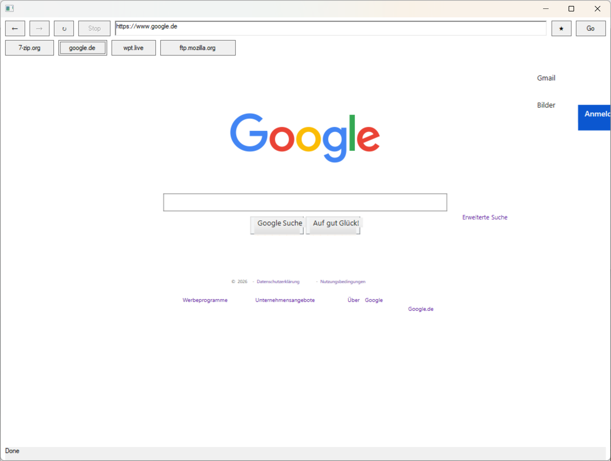
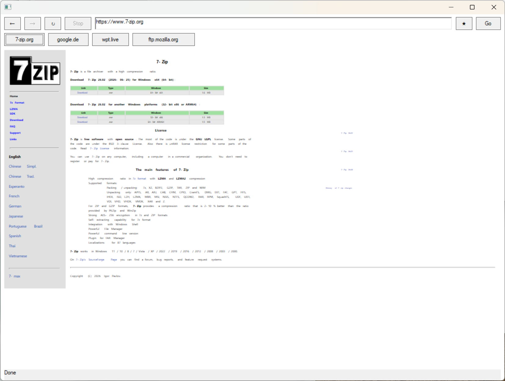
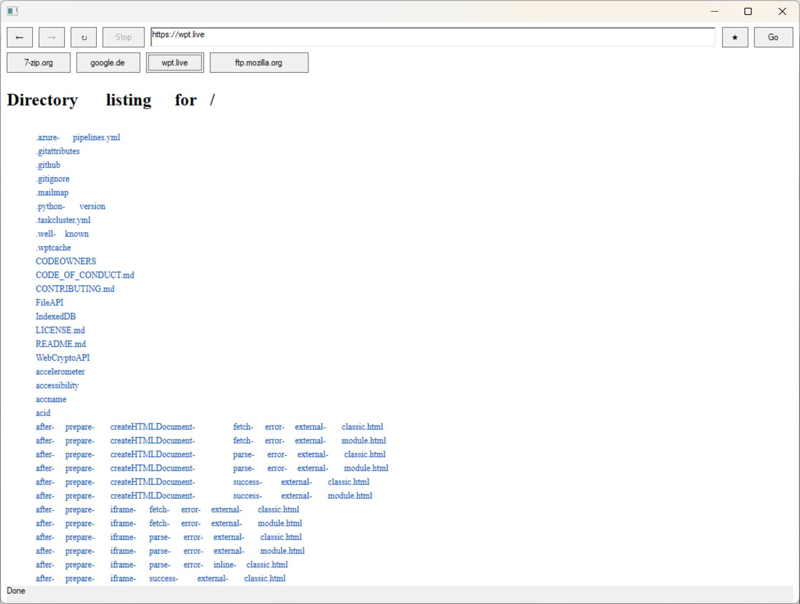
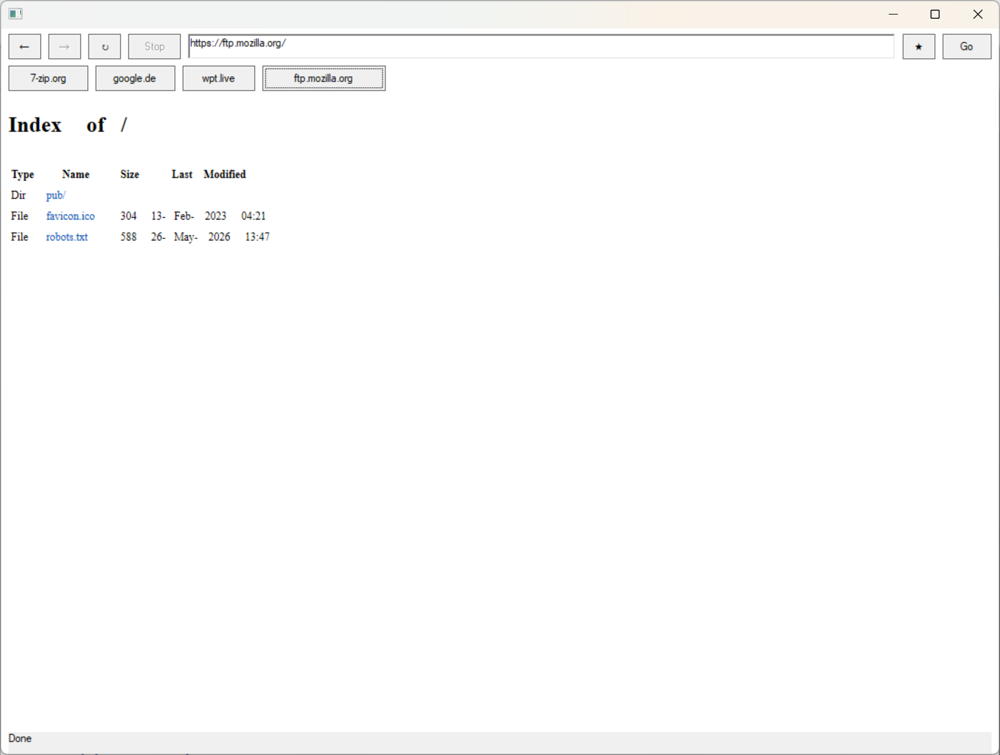

# Broiler Platform

**Browser and Office Infrastructure in Intermediate Language with Enhanced Reliability**

Broiler is an open-source platform project exploring a deliberately hard question:

> Can a modern browser and office platform be built entirely in managed .NET?

No Chromium. No native browser engine. No embedded WebView. Just managed .NET, modular architecture, automated standards testing, AI-assisted engineering, and human review.

Broiler is not trying to wrap an existing browser. It is building the shared infrastructure underneath browsers and office applications: scripting, document models, styling, layout, graphics, text, input, and runtime services.

## Preview

These screenshots show the current Windows Direct2D frontend rendering real pages during development.

<table>
  <tr>
    <td width="50%">
      
    </td>
    <td width="50%">
      
    </td>
  </tr>
  <tr>
    <td align="center">google.de</td>
    <td align="center">7-zip.org</td>
  </tr>
  <tr>
    <td width="50%">
      
    </td>
    <td width="50%">
      
    </td>
  </tr>
  <tr>
    <td align="center">wpt.live</td>
    <td align="center">ftp.mozilla.org</td>
  </tr>
</table>

## Current Status

Broiler is under active development and is **not yet intended for production use**.

Already implemented:

- ECMAScript / JavaScript engine
- Large parts of the HTML runtime
- Automated Test262 integration
- Automated Web Platform Tests (WPT) infrastructure
- Early Windows browser frontend based on Direct2D

Currently in progress:

- CSS engine improvements
- Layout engine
- Cross-platform graphics backends
- Browser shell
- Office document infrastructure

For WebAssembly, Broiler plans to integrate an existing third-party .NET engine such as **WACS** instead of reinventing that layer from scratch.

## Why Broiler Exists

Modern browsers and office suites are among the largest software systems in everyday use. They also share more infrastructure than they appear to:

- Document models
- Styling
- Layout
- Graphics
- Fonts and text shaping
- Scripting
- Runtime services
- Input, selection, editing, and accessibility

Broiler explores whether these foundations can be built once, in a modular managed runtime, and then reused across browser and office applications.

## Engineering Principles

### 100% Managed .NET

Every major subsystem is intended to be written in managed .NET. The goal is to improve maintainability, auditability, portability, and large-scale refactoring.

### Standards First

Compatibility is measured against real standards suites such as Test262 and Web Platform Tests. Interoperability should be tested, not guessed.

### Modular Architecture

Large systems become tractable when they are split into focused components with clear boundaries. That also makes the codebase easier for both humans and AI tools to understand.

### AI-Assisted, Human-Reviewed

Broiler uses AI as an implementation accelerator, not as the maintainer. Accepted changes still require human review, automated verification, and architectural discipline.

### Browser and Office Together

The same platform pieces that render web content can also support office documents, rich text editing, scripting, layout, graphics, and interaction.

## Enhanced Reliability

The "Enhanced Reliability" part of the name describes the engineering philosophy behind the project:

> Managed .NET + AI-assisted engineering + human review + automated verification = enhanced reliability.

AI can move quickly, but browser and office infrastructure must be careful software. Broiler treats automated tests, standards suites, small components, and human review as first-class parts of the development process.

## First Preview - July 1, 2026

Highlights:

- More than **99.99%** of the Test262 suite passes successfully, approximately **53,194** tests.
- More than **50%** of the CSS Web Platform Tests currently render correctly.
- Automated Test262 and WPT integration is active.
- The first Windows frontend is based on Direct2D.

ACID tests are no longer a primary compatibility target. Web Platform Tests provide much broader and more current coverage of web platform behavior.

## Roadmap

Next preview:

- Improved Web Platform Test compatibility
- UI and browser-shell improvements
- Expanded human review coverage
- First preview of **Broiler Writer**

Future milestones:

- Cross-platform graphics backends
- Office document model
- Rich text editing
- Additional HTML and CSS compatibility
- WebAssembly integration
- Performance optimization
- Linux, macOS, Android, and iOS support

## Why Another Browser?

Because browsers are too important to stop experimenting with.

Broiler investigates whether a browser written entirely in managed .NET can improve maintainability, auditability, portability, and AI-assisted development without abandoning standards compliance.

## Why Another Office Suite?

Because office applications and browsers share the same deep foundations: structured documents, layout, styling, graphics, scripting, text, editing, and runtime services.

Broiler aims to build those foundations once and reuse them.

## Why .NET?

Managed runtimes eliminate entire classes of memory-management problems and allow developers to focus more energy on architecture, compatibility, and correctness.

.NET also offers strong tooling, cross-platform ambitions, mature libraries, and practical support for large-scale refactoring - all useful for a modular platform built with extensive automated testing and AI assistance.

## The Story

Broiler started with a stubborn question:

> Is it possible to build a modern browser entirely in .NET?

The usual answer was: "Use Chromium."

Broiler's answer is: "No. Entirely in .NET."

Early experiments combined ideas from existing open-source projects such as **HTML Renderer** and **YantraJS**. That proved the direction was interesting, but also showed that a production-quality browser cannot be assembled by simply joining a renderer, a JavaScript engine, and a UI shell.

The architecture was gradually rebuilt into smaller components. Test262 and Web Platform Tests became part of the development workflow. The JavaScript engine reached near-complete Test262 compatibility, and the HTML/CSS/runtime work continued from there.

The broader realization came later: a browser platform and an office platform need many of the same foundations. That is when Broiler expanded from browser infrastructure into browser and office infrastructure.

## Name

Broiler began as an acronym idea:

**Browser and Office Infrastructure in Intermediate Language with Enhanced Reliability**

The name also happens to be memorable, which helps.

## Acknowledgements

Broiler would not exist without the work of open-source developers.

The project was initially bootstrapped with ideas and code from projects such as **HTML Renderer** and **YantraJS**, both licensed under Apache 2.0. Many thanks to the authors and contributors of those projects for providing such a strong foundation.

## License

Broiler is licensed under the [Apache License 2.0](../LICENSE).
