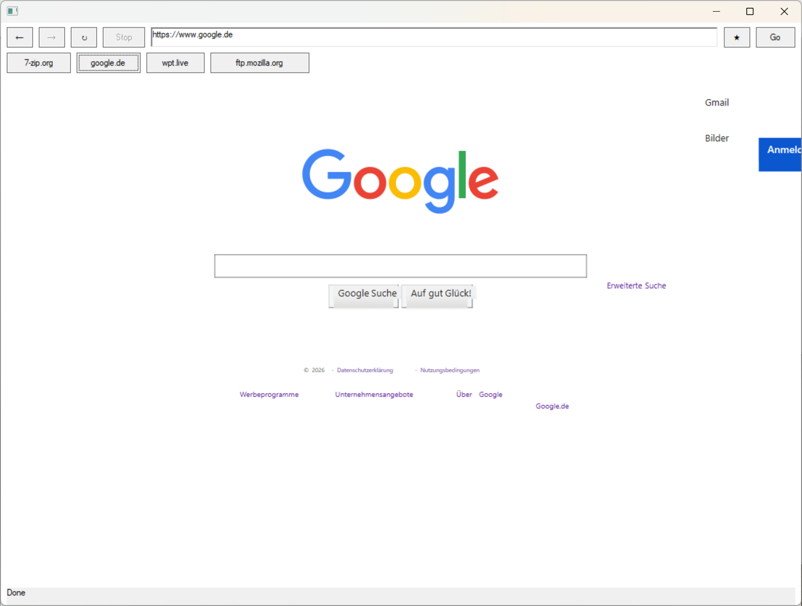
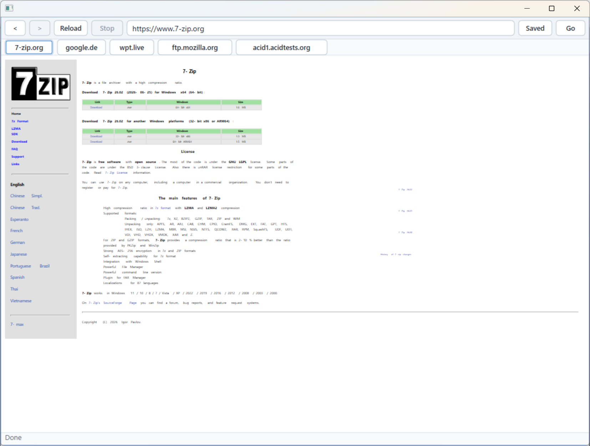
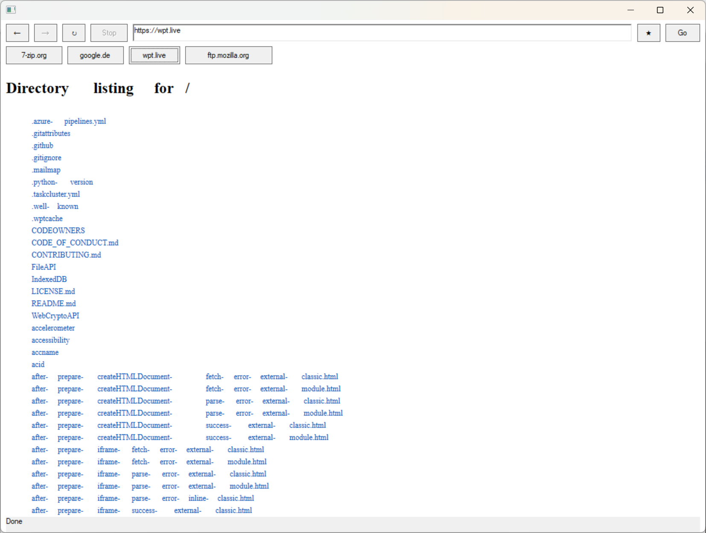
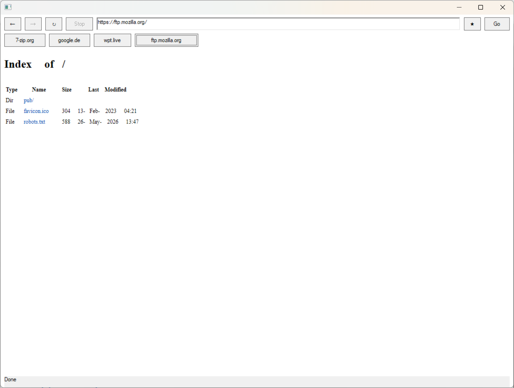
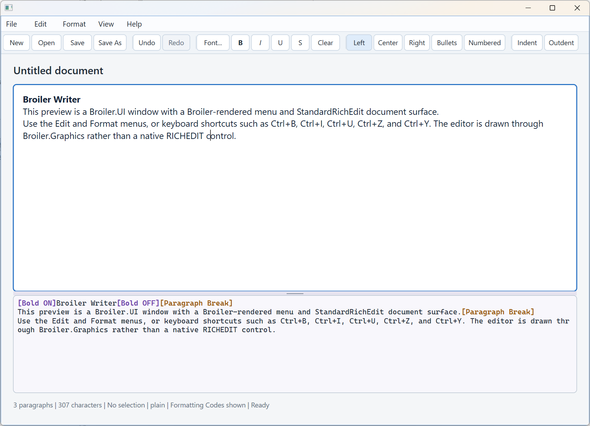
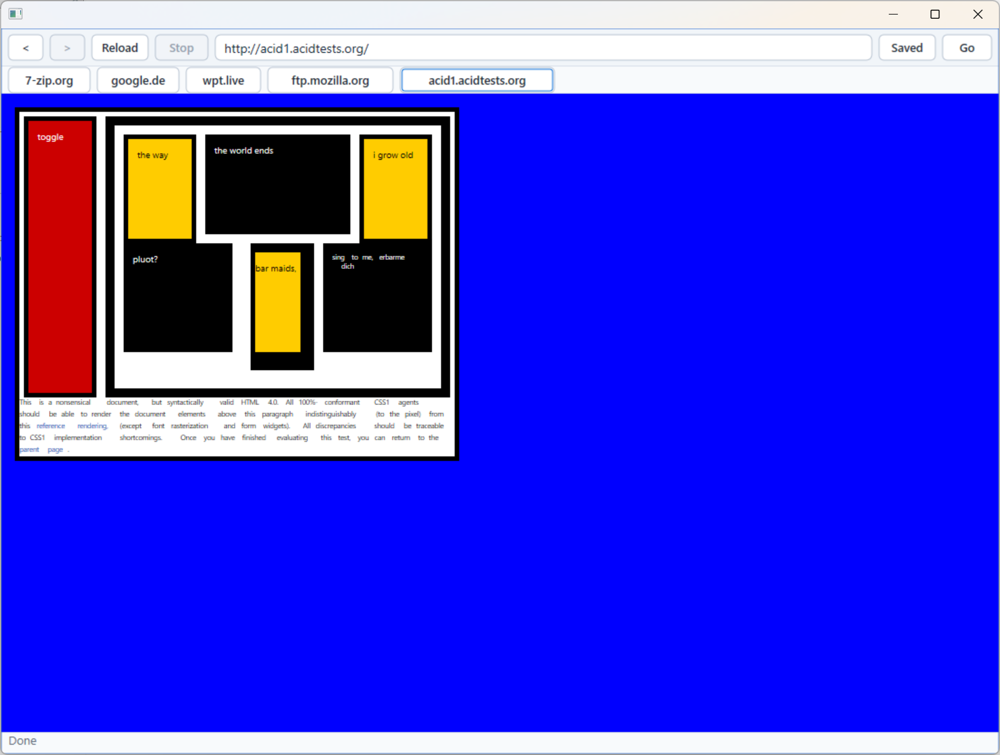

# Broiler Platform

> **Browser and Office Infrastructure in Intermediate Language with Enhanced Reliability**

[](https://github.com/Broiler-Platform/.github/blob/main/LICENSE)
[](https://github.com/Broiler-Platform/Broiler/releases)
[](https://github.com/Broiler-Platform/.github/blob/main/profile/docs/architecture.md)

Broiler is an open-source software platform exploring a deliberately ambitious question:

> **Can modern browser and office applications be built entirely in managed .NET?**

No Chromium. No embedded WebView. No native browser engine. Just managed .NET, modular architecture, open standards, automated verification, AI-assisted engineering, and human review.

Broiler is **not** a wrapper around an existing browser or office stack. It is a reusable platform for building browsers, office applications, document software, and future web-enabled tools on top of a shared managed runtime — built around a simple idea:

> Important application infrastructure should remain understandable, inspectable, portable, and replaceable.

> [!NOTE]
> Broiler is under active development and is **not yet intended for production use**.

---

## Platform Snapshot

| Component | Status |
|-----------|--------|
| ECMAScript (Test262) | **>99.99% passing** |
| WPT — ≥90% Chromium agreement | **93%** |
| WPT — ≥97% Chromium agreement | **85%** |
| WPT Reftests — pixel-identical | **84%** |
| Supported Platforms | Windows, Linux, Android |
| Reference Applications | Browser, Writer |
| Reference Deployment | BOSS |
| Document Formats | RTF, HTML, Markdown, DOCX |

---

## Architecture at a Glance

```text
                            Broiler Platform

        ┌──────────────────────────────────────────────────────┐
        │                                                      │
        │ ECMAScript • DOM • CSS • Layout • Graphics           │
        │ UI • Input • Documents • Runtime                     │
        │                                                      │
        └─────────────────────┬────────────────────────────────┘
                              │
          ┌───────────────────┼────────────────────┐
          │                   │                    │
   Broiler Browser      Broiler Writer        WebAssembly
   Windows/Linux/       Windows/Linux/             │
      Android              Android                 │
                                                   │
                                                  BOSS
```

| Application | What it is |
|-------------|------------|
| **Broiler Browser** | Reference browser on Windows, Linux and Android |
| **Broiler Writer** | Reference office/document application, also on Android |
| **BOSS** | Broiler Office Standalone Server — hosts the WebAssembly Writer via ASP.NET Core |

---

## Documentation

| Document | Contents |
|----------|----------|
| [Status and Roadmap](https://github.com/Broiler-Platform/.github/blob/main/profile/docs/status.md) | What works today, what is in progress, what comes next |
| [Architecture and Deployment](https://github.com/Broiler-Platform/.github/blob/main/profile/docs/architecture.md) | Platform layers, desktop/mobile/web, self-hosting, open infrastructure |
| [Engineering Principles](https://github.com/Broiler-Platform/.github/blob/main/profile/docs/principles.md) | Managed .NET, standards first, security, modularity, AI + human review |
| [Why Broiler](https://github.com/Broiler-Platform/.github/blob/main/profile/docs/why-broiler.md) | Why the platform exists, why .NET, why another browser and office |
| [Project Story](https://github.com/Broiler-Platform/.github/blob/main/profile/docs/project-story.md) | How Broiler started, and acknowledgements |

---

## Current Preview

These screenshots show the current state of Broiler during active development.

<table>
  <tr>
    <td width="50%">
      
    </td>
    <td width="50%">
      
    </td>
  </tr>
  <tr>
    <td align="center"><sub>google.de</sub></td>
    <td align="center"><sub>7-zip.org</sub></td>
  </tr>
  <tr>
    <td width="50%">
      
    </td>
    <td width="50%">
      
    </td>
  </tr>
  <tr>
    <td align="center"><sub>wpt.live</sub></td>
    <td align="center"><sub>ftp.mozilla.org</sub></td>
  </tr>
  <tr>
    <td width="50%">
      
    </td>
    <td width="50%">
      
    </td>
  </tr>
  <tr>
    <td align="center"><sub>Broiler Writer</sub></td>
    <td align="center"><sub>Acid1</sub></td>
  </tr>
</table>

---

## Getting Started

- [Download the latest Preview Release](https://github.com/Broiler-Platform/Broiler/releases)
- Explore the [source code](https://github.com/Broiler-Platform/Broiler)
- Try Broiler Browser and Broiler Writer
- Run the Writer through BOSS
- Explore upcoming NuGet packages for platform components
- [Report bugs and compatibility problems](https://github.com/Broiler-Platform/Broiler/issues)

Feedback and contributions are always appreciated.

---

## Contributing

Contributions of all kinds are welcome — code, documentation, testing, ideas, interoperability reports, or security analysis.

Please read `CONTRIBUTING.md`, `CODE_OF_CONDUCT.md` and `SECURITY.md` before opening a pull request.

---

## License

Broiler is licensed under the **Apache License 2.0**.
